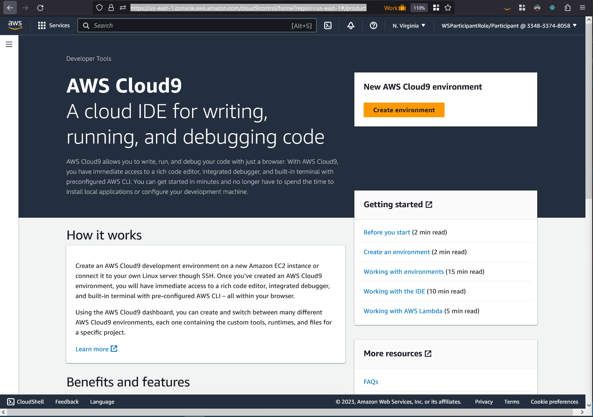
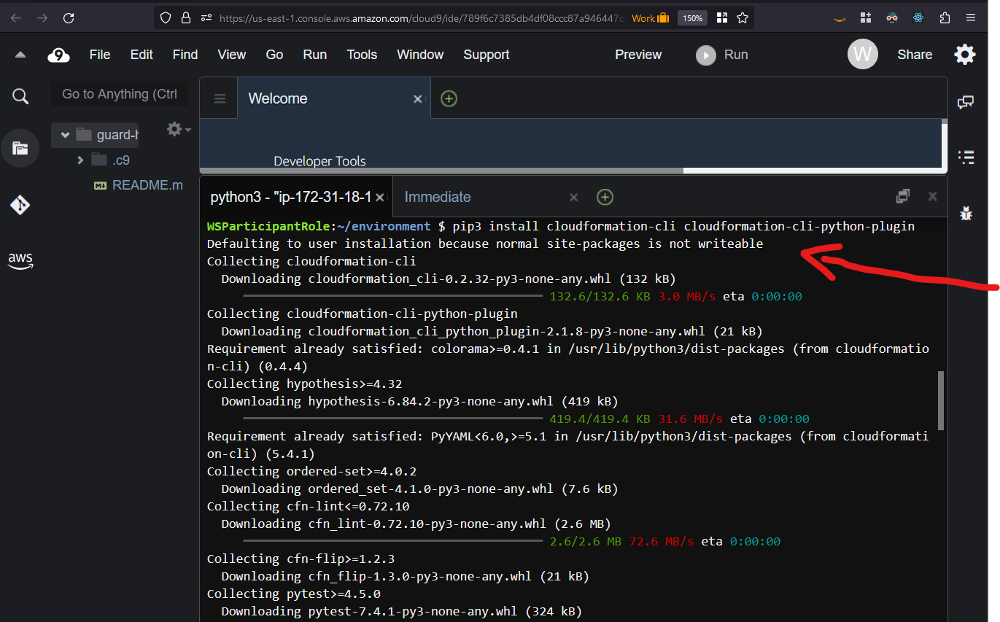
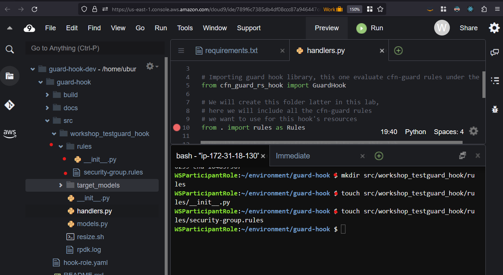

# CFN Guard workshop

This Workshop will guide you step by step on how to create your own CloudFormation Hook that internally uses cfn guard to evaluate the resources being provided.

# Index
1. [initial set up Cloud9](#1-initial-set-up-cloud9)
   1. [create a new development instance](#1-create-a-new-development-instance)
   2. [Install CloudFormation Guard and CloudFormation cli](#2-install-cloudformation-guard-and-cloudformation-cli)
2. [Initiate your project](#2-initiate-your-project)
   1. [Create Project Directory](#1-create-project-directory)
   2. [Initiate CFN Project](#2-initiate-cfn-project)
   3. [Follow the Wizard](#3-follow-the-wizard)
3. [Define your Hook](#3-define-your-hook)
   1. [Modeling Your Hook](#1-modeling-your-hook)
4. [Adding Guard Library](#4-adding-guard-library)
   1. [Installing Dependencies](#1-installing-dependencies)
   2. [Writing the handler.py File](#2-writing-the-handlerpy-file)
5. [Writing our Cfn Guard Rules](#5-writing-our-cfn-guard-rules)
   1. [Rules directory](#1-rules-directory)
   2. [Guard Rules](#2-guard-rules)
   3. [TypeConfiguration Properties and Guard](#3-typeconfiguration-properties-and-guard)
6. [Contract Testing](#6-contract-testing)
   1. [Contract Test](#1-contract-test)
   2. [Spesifying Input Data for Contract Test](#2-spesifying-input-data-for-contract-test)
   3. [Create TypeConfiguration for Hook](#3-create-typeconfiguration-for-hook)
   4. [Testing locally with SAM](#4-testing-locally-with-sam)
7. [Registering your Hook](#7-registering-your-hook)
   1. [Submit and Set Default](#1-submit-and-set-default)
   2. [Manually Create a Security Group](#2-manually-create-a-security-group)
   3. [Template Files for Remote Test](#3-template-files-for-remote-test)
   4. [Deploying resources](#4-deploying-resources)

# 1. Initial Set Up Cloud9

## 1. create a new development instance

First navigate to [Cloud9 Console](https://us-east-1.console.aws.amazon.com/cloud9control/home?region=us-east-1#/product) click `Create environment`.



Next, let's configure this enviroment:
1. name: `guard-hook-dev`
2. EC2 Instance Type: `m5.large`
3. Platform: `Ubuntu Server`
   


Leave the rest of the values as they where and click `create` to start provisioning the environment.


After a few minutes your environment will be ready to run, click `open` to run Cloud9 on a new browser tab.


At this point you have your IDE ready to go.
Quick notes:
1. `File tree`
2. `Main code area`
3. `Terminal`


Now, let's inscrease the disk size of our Cloud9 environment.
First, let's download the resize script
```sh
wget https://raw.githubusercontent.com/brianterry/resource-type-workshop/main/resize.sh
```


Then let's run it to resize to 50GB
```sh
chmod +x resize.sh
./resize.sh 50
```


_[back to index](#index)_

---


## 2. Install CloudFormation Guard and CloudFormation cli


### 1. cfn-guard
Follow [instaltion steps](https://github.com/aws-cloudformation/cloudformation-guard#guard-cli) according to your environment


On the terminal, 
```sh
curl --proto '=https' --tlsv1.2 -sSf https://raw.githubusercontent.com/aws-cloudformation/cloudformation-guard/main/install-guard.sh | sh
```


If you try to run `cfn-guard` you will get a `command not found` (1) error, we need to add an enviroment variable (2) by running the following command:

```sh
export PATH=${PATH}:~/.guard/bin
```


Then if you run the command again, you will be able to see an output (3).

### 2. cfn cli

Installation documentation can be found [here](https://docs.aws.amazon.com/cloudformation-cli/latest/userguide/what-is-cloudformation-cli.html#installing-cfn-cli-python).

For Cloud9, let's run the following command to install `cfn cli` from `pip`:
```sh
pip3 install cloudformation-cli cloudformation-cli-python-plugin
# other avaiable plugins: cloudformation-cli-java-plugin cloudformation-cli-go-plugin  cloudformation-cli-typescript-plugin
```



Veryfi installation by running `cfn --version`, you should see something like this:


_[back to index](#index)_

---


# 2. Initiate your project:

The first step in creating your hook project is to initiate your project. You can use the CloudFormation CLI [init command](https://docs.aws.amazon.com/cloudformation-cli/latest/userguide/resource-type-cli-init.html) to initiate your hook project.

The init command launches a wizard that walks you through setting up the project.

Follow these steps to initiate your hook project:


## 1. Create Project Directory 

In the CloudFormation CLI, create a directory inside the CloudFormationCLI/ that stores your hook project. This example uses the directory name `guard-hook`.

Create a directory named `guard-hook` that will stores your project.

```sh
mkdir guard-hook
cd guard-hook
```


## 2. Initiate CFN Project

Use the [init command](https://docs.aws.amazon.com/cloudformation-cli/latest/userguide/resource-type-cli-init.html) to initialize a CloudFormation project.

```sh
cfn init
```
this will return
```
Initializing new project
```

## 3. Follow the Wizard

1. The `init` command launches a wizard that walks you through setting up the project. When prompted, enter `h` to specify a hooks project.

```
Do you want to develop a new resource(r) or a module(m) or a hook(h)?.
>> h
```

2. Enter your hook type identifier. For example, Workshop::TestGuard::Hook

```
What's the name of your hook type?
(Organization::Service::Hook)
>> Workshop::TestGuard::Hook
```

3. The wizard then enables you to select the appropriate language plugin. Python 3.7 to 3.9 are supported.

```
Select a language for code generation:
[1] python37
[2] python38
[3] python39
(enter an integer):
>> 3
```

4. Choose docker for platform-independent packaging. While docker isn't required, it's highly recommended to make development easier.

```
Use docker for platform-independent packaging (Y/n)?
This is highly recommended unless you are experienced 
with cross-platform Python packaging.
>> Y
```

_This is an overview of the whole wizard_


5. List the content of the directory by using the ls command.

```sh
# if using bash
ls -la

# if using Powershell
ls
```

List the content of the directory by using the ls command.

```

Mode                 LastWriteTime         Length Name
----                 -------------         ------ ----
d----           8/21/2023  1:36 PM                docs
d----           8/21/2023  1:36 PM                src
-a---           8/21/2023  1:36 PM           1888 .gitignore
-a---           8/21/2023  1:36 PM            676 .rpdk-config
-a---           8/21/2023  1:36 PM           1264 hook-role.yaml
-a---           8/21/2023  1:36 PM           1882 README.md
-a---           8/21/2023  1:36 PM             38 requirements.txt
-a---           8/21/2023  1:36 PM           4348 rpdk.log
-a---           8/21/2023  1:36 PM            650 template.yml
-a---           8/21/2023  1:36 PM           1147 workshop-testguard-hook.json
```

_[back to index](#index)_

---


# 3. Define your Hook

## 1. Modeling Your Hook

In this section, we will model our hook. In this example we will create hook for AWS CloudFormation that describes Security Group.

When you initiate the hook project, an example hook schema file is included to help start you modeling your hook. In the case of our example hook, the schema file is named `workshop-testguard-hook.json`.

Open this file in your code editor, it shoudl look similar to this one:


1. `typeConfigurations` are extra properties or parameters we can pass to owr hook, in Our case it could be the `VpcId` so all the security groups are created only in that one VPC.
2. `handlers`, here you can configure where in the life cycle you and to what resources you want you hook to be applied.


_sample default configuration file_
```json
{
    "typeName": "Workshop::TestGuard::Hook",
    "description": "Example resource SSE (Server Side Encryption) verification hook",
    "sourceUrl": "https://github.com/aws-cloudformation/example-sse-hook",
    "documentationUrl": "https://github.com/aws-cloudformation/example-sse-hook/blob/master/README.md",
    "typeConfiguration": {
        "properties": {
            "EncryptionAlgorithm": {
                "description": "Encryption algorithm for SSE",
                "default": "AES256",
                "type": "string"
            }
        },
        "additionalProperties": false
    },
    "required": [],
    "handlers": {
        "preCreate": {
            "targetNames": [
                "AWS::S3::Bucket"
            ],
            "permissions": []
        },
        "preUpdate": {
            "targetNames": [
                "AWS::S3::Bucket"
            ],
            "permissions": []
        },
        "preDelete": {
            "targetNames": [
                "AWS::S3::Bucket"
            ],
            "permissions": []
        }
    },
    "additionalProperties": false
}

```

There are a couple of changes we need to do, one of them is to change all the instances of `AWS::S3::Bucket` for `AWS::EC2::SecurityGroup`.
This will let CloudFormation knows that we want to excecute this hook when Security Groups are present.

Last, remove the `preDelete` handler.

<!-- Then let's delete the pre_delete handler -->

Now let's work on [typeConfiguration](https://docs.aws.amazon.com/cloudformation-cli/latest/userguide/hooks-structure.html#hooks-properties-typeconfiguration).

First, replace the content of `typeConfiguration` for the following snippet:

```json
{
  "properties": {
      "VpcId": {
          "description": "VPC where Security groups can be created",
          "default": "authorized-vpc",
          "type": "string"
      }
  },
  "additionalProperties": false
}
```


The file should look like this:


And replace all the instances of `AWS::S3::Bucket` with `AWS::EC2::SecurityGroup`

_updated config file_
```json
{
    "typeName": "Workshop::TestGuard::Hook",
    "description": "Example resource SSE (Server Side Encryption) verification hook",
    "sourceUrl": "https://github.com/aws-cloudformation/example-sse-hook",
    "documentationUrl": "https://github.com/aws-cloudformation/example-sse-hook/blob/master/README.md",
    "typeConfiguration": {
        "properties": {
            "VpcId": {
                "description": "VPC where Security groups can be created",
                "default": "defaultVPC",
                "type": "string"
            }
        },
        "additionalProperties": false
    },
    "required": [],
    "handlers": {
        "preCreate": {
            "targetNames": [
                "AWS::EC2::SecurityGroup"
            ],
            "permissions": []
        },
        "preUpdate": {
            "targetNames": [
                "AWS::EC2::SecurityGroup"
            ],
            "permissions": []
        }
    },
    "additionalProperties": false
}

```

Finally, run `cfn generate` to update hook configuration files
```sh
cfn generate
```

This command should output:
```
Generated files for MyCompany::Testing::hook
```


This command will auto generate source code and configuration files based on your `workshop-testguard-hook.json` file.


_[back to index](#index)_

---


# 4. Adding Guard Library

## 1. Installing Dependencies
For our Hook to easily consume guard rules, we are going to add a couple of libraries like [cfn_guard_rs_hook](https://github.com/aws-cloudformation/community-registry-extensions/tree/main/packages/cfn_guard_rs_hook)

On our `guard-hook/requirements.txt` file, lets add `Jinga2`, `cfn_guard_rs` and `cfn_guard_rs_hook`.

Our `requirements.txt` should look like this:
```
cloudformation-cli-python-lib>=2.1.9
Jinja2==3.1.2
cfn_guard_rs>=0.1.0
cfn_guard_rs_hook>=0.1.0
```


Then, add the required libraries by running the following command:

```sh
pip3 install -r requirements.txt
```

## 2. Writing the handler.py File

Then, let's locate the file `./src/workshop_testguard_hook/handlers.py`. This file is the autogenerated logic for a python hook. This is the type of hook where you write your rules as python code. In our case, we will using Guard rules to define what to evaluate.

Delete the content of the file, and lets write the new version.

```python
# Importing logging library
import logging

# Importing guard hook library, this one evaluate cfn-guard rules under the hood
from cfn_guard_rs_hook import GuardHook

# We will create this folder latter in this lab,
# here we will include all the cfn-guard rules
# we want to use for this hook's resources
from . import rules as Rules

# We will create this configuration later on this lab
from .models import TypeConfigurationModel

# Use this logger to forward log messages to CloudWatch Logs.
LOG = logging.getLogger(__name__)

# your hook's type name, it can be found on .rpdk-config file
TYPE_NAME = "Workshop::TestGuard::Hook"

hook = GuardHook(TYPE_NAME, TypeConfigurationModel, Rules)
test_entrypoint = hook.test_entrypoint

```


_NOTE:_ on the `handlers.py` line 10 we can se a warning from the IDE, don't worry, we are going to fix it soon.


Finally, we want to build the project by running [the submit command](https://docs.aws.amazon.com/cloudformation-cli/latest/userguide/resource-type-cli-submit.html)
```sh
cfn submit --dry-run
```


_[back to index](#index)_

---


# 5. Writing our Cfn Guard Rules

## 1. Rules directory

In order to evaluate the rules we will be creating, we need a place to store them and a way for python to know where to find them.

_note:_ the follwing actions can be done using the ui.

Create a `rules` file in the `./src/workshop_testguard_hook`
```sh
mkdir ./src/workshop_testguard_hook/rules
```

In the rules folder create an empty `__init__.py` file. This will allow python to know this folder can be imported.
```sh
touch ./src/workshop_testguard_hook/rules/__init__.py
```

Let's create our fist rule file `security-group.rules` on the newly created `rules` folder.

**./src/workshop_testguard_hook/rules/security-group.rules**
```sh
touch src/workshop_testguard_hook/rules/security-group.rules
```




## 2. Guard Rules

In order to write Guard rules, we need to learn some basics [CloudFormation Guard](https://github.com/aws-cloudformation/cloudformation-guard).

_AWS CloudFormation Guard is an open-source general-purpose policy-as-code evaluation tool. It provides developers with a simple-to-use, yet powerful and expressive domain-specific language (DSL) to define policies and enables developers to validate JSON- or YAML- formatted structured data with those policies._


```
let sgs = Resources.*[ Type == 'AWS::EC2::SecurityGroup' ]

rule private_security_group_ingress when %sgs !empty {
    when %sgs.Properties.SecurityGroupIngress !empty {
        %sgs.Properties {
            SecurityGroupIngress[*] {
                CidrIp empty
                <<
                  SecurityGroup Ingress must be from another security group,
                  submit a ticket on support.company.com if you need an internet facing security group
                >>
                CidrIpv6 empty
                <<
                  SecurityGroup Ingress must be from another security group,
                  call your admin if your need an internet facing security group
                >>
            }
        }
    }
}

rule private_security_group_egress when %sgs !empty {
    when %sgs.Properties.SecurityGroupEgress !empty {
        %sgs.Properties {
            SecurityGroupEgress[*] {
                CidrIp empty
                <<
                  SecurityGroup Egrees must be to another security group,
                  call your admin if your need an internet facing security group
                >>
                CidrIpv6 empty
                <<
                  SecurityGroup Egress must be tp another security group,
                  call your admin if your need an internet facing security group
                >>
            }
        }
    }
}

```


## 3. TypeConfiguration Properties and Guard

The `cfn_guard_rs_hook` library uses [Jinja](https://jinja.palletsprojects.com/) to configure Guard rules, so we can use the values from `typeConfiguration` properties on the cfn guard template.

Given the following `typeConfiguration`:
```json
{
    "typeConfiguration": {
        "properties": {
            "VpcId": {
                "description": "VPC where Security groups can be created",
                "default": "defaultVPC",
                "type": "string"
            }
        },
        "additionalProperties": false
    },
}
```
<!-- You can use the value `VpcId` on the rule file by surrounding it with double curly braces `{{VpcId}}`. -->
<!-- 
Let's add this rule too!

```
rule allowed_vpc when %sgs !empty {
    %sgs.Properties.VpcId == {{VpcId}}
}
``` -->


_[back to index](#index)_

---


# 6. Contract Testing 

## 1. Contract Test

Now that you've coded your handler functions, it's time to test your hook with contract test. As you model and develop your hook, you should have the CloudFormation CLI perform tests to ensure that the hook is behaving as expected during each event.


Each handler and target are tested twice. One force `SUCCESS` once for `FAILED`

For `SUCCESS` response case:
- Status must be SUCCESS.
- Must not return an error code.
- Callback delay should be set to 0 seconds, if specified.

For `FAILED` response case:
- Status must be FAILED.
- Must return an error code.
- Must have a message in response.
- Callback delay should be set to 0 seconds, if specified.

For `IN_PROGRESS` response case:
- Must not return an error code.
- Result field must not be set in response.

## 2. Spesifying Input Data for Contract Test

There are 2 ways of specifying input data, one is `input files` the second is `overrides file`.

_more detail on [Specifying input data for use in contract tests](https://catalog.us-east-1.prod.workshops.aws/workshops/f09fd78b-ef8a-4a9d-9d2b-f31a3e6ca956/en-US/python/contracttesting#specifying-input-data-for-use-in-contract-tests) page_


Before creating the `Override files`, let's create an `inputs` folder on `./guard-hook`.
```sh
mkdir inputs
touch inputs/inputs_1_pre_create.json
touch inputs/inputs_1_pre_update.json
touch inputs/inputs_n_pre_delete.json
touch inputs/inputs_1_invalid.json
```


Here are the content we need to add to each file:
- [inputs_1_pre_create.json](#inputs_1_pre_createjson)
- [inputs_1_pre_update.json](#inputs_1_pre_updatejson)
- [inputs_n_pre_delete.json](#inputs_n_pre_deletejson)
- [inputs_1_invalid.json](#inputs_1_invalidjson)
  

<!-- this is my default vpc vpc-0c3d8d1db2932153b -->


### inputs_1_pre_create.json
```json
{
  "AWS::EC2::SecurityGroup": {
    "resourceProperties": {
      "GroupDescription": "valid SG",
      "GroupName": "validSG",
      "SecurityGroupEgress": [
        {
          "SourceSecurityGroupId": "sg-validId1",
          "FromPort": 443,
          "ToPort": 3000,
          "IpProtocol": "tcp"
        }
      ],
      "SecurityGroupIngress": [
        {
          "SourceSecurityGroupId": "sg-validId2",
          "FromPort": 443,
          "ToPort": 3000,
          "IpProtocol": "tcp"
        }
      ],
      "VpcId": "vpc-authotizedvpc"
    }
  }
}
```

### inputs_1_pre_update.json
```json
{
  "AWS::EC2::SecurityGroup": {
    "resourceProperties": {
      "GroupDescription": "valid SG",
      "GroupName": "validSG",
      "SecurityGroupEgress": [
        {
          "SourceSecurityGroupId": "sg-validId3",
          "FromPort": 443,
          "ToPort": 3000,
          "IpProtocol": "tcp"
        }
      ],
      "SecurityGroupIngress": [
        {
          "SourceSecurityGroupId": "sg-validId4",
          "FromPort": 443,
          "ToPort": 3000,
          "IpProtocol": "tcp"
        }
      ],
      "VpcId": "vpc-authotizedvpc"
    },
    "previousResourceProperties": {
      "GroupDescription": "valid SG",
      "GroupName": "validSG",
      "SecurityGroupEgress": [
        {
          "SourceSecurityGroupId": "sg-validId1",
          "FromPort": 443,
          "ToPort": 3000,
          "IpProtocol": "tcp"
        }
      ],
      "SecurityGroupIngress": [
        {
          "SourceSecurityGroupId": "sg-validId2",
          "FromPort": 443,
          "ToPort": 3000,
          "IpProtocol": "tcp"
        }
      ],
      "VpcId": "vpc-authotizedvpc"
    }
  }
}
```


### inputs_1_pre_delete.json
```json
{
  "AWS::EC2::SecurityGroup": {
    "resourceProperties": {
      "GroupDescription": "valid SG",
      "GroupName": "validSG",
      "SecurityGroupEgress": [
        {
          "SourceSecurityGroupId": "sg-validId1",
          "FromPort": 443,
          "ToPort": 3000,
          "IpProtocol": "tcp"
        }
      ],
      "SecurityGroupIngress": [
        {
          "SourceSecurityGroupId": "sg-validId2",
          "FromPort": 443,
          "ToPort": 3000,
          "IpProtocol": "tcp"
        }
      ],
      "VpcId": "vpc-authotizedvpc"
    }
  }
}
```

### inputs_1_invalid.json
```json
{
  "AWS::EC2::SecurityGroup": {
    "resourceProperties": {
      "GroupDescription": "invalid SG",
      "GroupName": "invalidSG",
      "SecurityGroupEgress": [
        {
          "CidrIp": "192.168.1.122",
          "FromPort": 443,
          "ToPort": 3000,
          "IpProtocol": "tcp"
        }
      ],
      "SecurityGroupIngress": [
        {
          "CidrIp": "192.168.1.123",
          "FromPort": 443,
          "ToPort": 3000,
          "IpProtocol": "tcp"
        }
      ],
      "VpcId": "vpc-unauthotizedvpc"
    }
  }
}
```
<!-- 
### inputs_1_invalid_pre_update.json
```json

``` -->

## 3. Create TypeConfiguration for Hook

To test your hook locally, you will need to create a `typeConfiguration.json` and save it in `~/.cfn-cli/`

**typeConfiguration.json**
In this file we can specify 3 key elements.
- **TargetStack:** either `NONE` or `ALL`, this is like the `on` `off` switch for your hook.
- **FailureMode:** either `WARN` or `FAIL`
- **Properties:** properties defined when modeling the hook

Let's use this file as configuration, here we are telling CloudFormation to `fail` if the resource is not compliant, and apply this hook to `all` stack.

first create a local `typeConfiguration.json` file:
```sh
touch typeConfigurations.json
```

Use the following configuration as an starting point:
```json
{
  "CloudFormationConfiguration": {
    "HookConfiguration": {
      "TargetStacks": "ALL",
      "FailureMode": "FAIL",
      "Properties": {
        "VpcId": "validVPCID"
      }
    }
  }
}
```
<!-- cfn-guard validate -r src/workshop_testguard_hook/rules/security-group.rules -d templates/compliant.json  -->


## 4. Testing locally with SAM
_more detail [here](https://catalog.us-east-1.prod.workshops.aws/workshops/f09fd78b-ef8a-4a9d-9d2b-f31a3e6ca956/en-US/python/contracttesting#testing-hook-types-locally-using-sam)_

Open a second terminal `Alt + t` (on Cloud9), and activate the python environment

<!-- ```sh
# cd to guardHookProject project folder

## if you are on unix
source env/bin/activate

## if you are on windows
. ./env/Scripts/Activate.ps1 
```
-->

then cd into `guard-hook` folder and start the sam lambda execution:
```sh
cd guard-hook
sam local start-lambda
```


now in the first terminal let's execute the test by running:
```sh
cfn test -v --typeconfig typeConfigurations.json
```


_note:_ error on pre_delete hook is a know but, it won't stop the flow of the lab

_[back to index](#index)_

---


# 7. Registering your Hook

## 1. Submit and Set Default

Register your hook by using the [submit command](https://docs.aws.amazon.com/cloudformation-cli/latest/userguide/resource-type-cli-submit.html).
```sh
cfn submit --set-default
```


You can view you registered hooks by running the following command:
```sh
aws cloudformation list-types
```

Locate the current hook in the result, look for `"TypeName": "Workshop::TestGuard::Hook"`
and take note of the `TypeArn`, we will use it in the next step.


Now, we need to get the current VPC id, we can get it from the terminal by running:
```sh
aws ec2 describe-vpcs
```


<!-- Let's activate our hook using [aws cli](https://awscli.amazonaws.com/v2/documentation/api/latest/reference/cloudformation/set-type-configuration.html).
replace `__YOUR_VPC_ID__` with the response vpc id. And your `__YOUR_TYPE_ARN__` with its corresponding value.
```sh
aws cloudformation --region us-east-1 set-type-configuration  --configuration '{"CloudFormationConfiguration":{"HookConfiguration":{"TargetStacks":"ALL","FailureMode":"FAIL","Properties":{"VpcId": "__YOUR_VPC_ID__"}}}}' --type-arn __YOUR_TYPE_ARN__
``` -->

Let's activate our hook using [aws cli](https://awscli.amazonaws.com/v2/documentation/api/latest/reference/cloudformation/set-type-configuration.html).
replace your `__YOUR_TYPE_ARN__` with its corresponding value.
```sh
aws cloudformation --region us-east-1 set-type-configuration  --configuration '{"CloudFormationConfiguration":{"HookConfiguration":{"TargetStacks":"ALL","FailureMode":"FAIL","Properties":{ }}}}' --type-arn __YOUR_TYPE_ARN__
```

After this command, you should see a similar output:

```
{
    "ConfigurationArn": "arn:aws:cloudformation:us-east-2:__account_id__:type-configuration/hook/Workshop-TestGuard-Hook/default"
}
```


Finally, we can view our Hook on the [CloudFormation Registry console](https://us-east-1.console.aws.amazon.com/cloudformation/home?region=us-east-1#/registry/activated-extensions/hooks?category=REGISTERED&type=HOOK) you will be able to see the registered hook.


## 2. Manually Create a Security Group

We are going to create the main Security Group, this one will be used as source and target of our test. Imagine this SG is given to you by other organization and you want to create your own security groups that can talk with this one.

First, let's open the [EC2 Security Groups AWS Console](https://us-east-2.console.aws.amazon.com/ec2/home?region=us-east-2#SecurityGroups) and click on `Create Security Group`.


Give it a name, it can be `guard-hook-main-sg`. Add a description and click on `Create security group`.


Then copy the `Security Group ID` and `Vpc ID`, we will use them on the next step.


## 3. Template files for Remote Test

In order to see our `guard-hook` in action, we neet to deploy a `compliant` and `non-compliant` stacks. Let's first create a `templates` folder on `./guard-hook`.

Then lets create the following files inside `templates`, replace the `DestinationSecurityGroupId` and `SourceSecurityGroupId` for the id you copied on the previous step :

```sh
mkdir templates
touch templates/compliant.json
touch templates/non-compliant.json

```

**compliant.json**
```json
{
  "Parameters": {},
  "Resources": {
    "SG": {
      "Type": "AWS::EC2::SecurityGroup",
      "Properties": {
        "GroupDescription": "valid SG",
        "GroupName": "validSG",
        "SecurityGroupEgress": [
          {
            "DestinationSecurityGroupId": "__copied from previous step__",
            "FromPort": 443,
            "ToPort": 3000,
            "IpProtocol": "tcp"
          }
        ],
        "SecurityGroupIngress": [
          {
            "SourceSecurityGroupId": "__copied from previous step__",
            "FromPort": 443,
            "ToPort": 3000,
            "IpProtocol": "tcp"
          }
        ],
        "VpcId": "__copied from previous step__"
      }
    }
  }
}
```

**non-compliant.json**
```json
{
  "Parameters": {},
  "Resources": {
    "SG": {
      "Type": "AWS::EC2::SecurityGroup",
      "Properties": {
        "GroupDescription": "invalid SG",
        "GroupName": "invalidSG",
        "SecurityGroupEgress": [
          {
            "CidrIp": "192.168.1.122",
            "FromPort": 443,
            "ToPort": 3000,
            "IpProtocol": "tcp"
          }
        ],
        "SecurityGroupIngress": [
          {
            "CidrIp": "192.168.1.123",
            "FromPort": 443,
            "ToPort": 3000,
            "IpProtocol": "tcp"
          }
        ],
        "VpcId": "__copied from previous step__"
      }
    }
  }
}
```


## 4. Deploying resources

Now that we have both templates ready, lets start by publishing the `compliant` stack.
```sh
aws cloudformation create-stack --stack-name compliant --template-body file://templates/compliant.json

```

You should get a similar output:
```
{
    "StackId": "arn:aws:cloudformation:us-east-2:__account_id__:stack/compliant/0bb44e80-4127-11ee-9b03-0282e8f12ae7"
}
```

If you check your [CloudFormation console]() you should see the stack being created


Now let's test the `non compliant` stack:
```sh
aws cloudformation create-stack --stack-name non-compliant --template-body file://templates/non-compliant.json
```
You should get a similar output:
```
{
    "StackId": "arn:aws:cloudformation:us-east-2:__account_id__:stack/non-compliant/7fc91db0-412b-11ee-bfa9-0362fddb0cd3"
}
```

Now, on the [CloudFormation console]() we can see this template failed.


_[back to index](#index)_

---


# Next Steps

Congratulations! you have created, published and tested your new `guard-hook`!

Now you can start experimenting with more complex guard rules. Check [this link](https://docs.aws.amazon.com/cfn-guard/latest/ug/what-is-guard.html) for more information.

Also check how to [deploy hooks to multiple accounts using Stack Sets](https://github.com/aws-cloudformation/community-registry-extensions/tree/main/hooks/KMS_EncryptionSettings#Hook-registry-submission-with-StackSets).


Thank you!


_[back to index](#index)_

---


